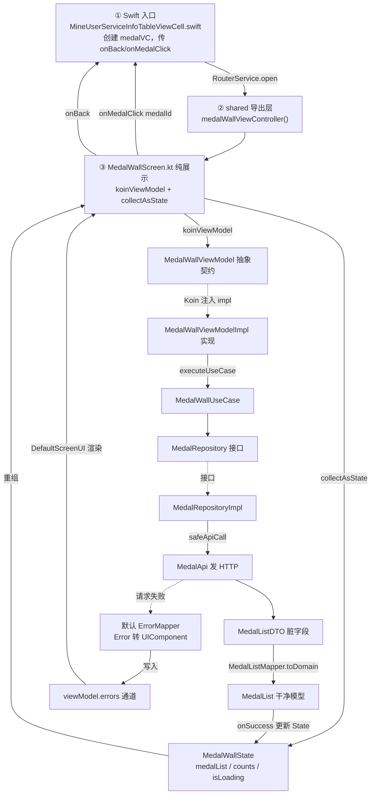

layout:     post
title:      KMP 页面开发指南（以“勋章墙”为例）
subtitle:   
date:       2026-07-30
author:     夏天无泪
catalog: true
tags:
    - 学习记录
# KMP 页面开发指南（以“勋章墙”为例）

> 适用项目：ruyi-app（KMP 多组件仓库）+ wandafilm-mine（原生 iOS 工程）
> 记录时间：2026-07-30
> 一句话：新增一个页面 = 数据层（app-common）+ UI 层（app-main）+ iOS 导出层（shared）+ 原生调用（wandafilm-mine）。

---

## 一、仓库 / 分层对应关系

| 仓库（组件） | 目录 | 职责 |
|---|---|---|
| app-common | `app-common/...` | 数据层：domain / data / datasource（接口、DTO、Mapper、Repository、UseCase） |
| app-main | `app-main/mine/...` | UI 层：Compose 页面 + ViewModel + Koin 注册 |
| shared | `shared/src/iosMain/...` | iOS 导出层：把 Compose 页面包成 `ComposeUIViewController` 工厂 |
| wandafilm-mine | `WandaFilm-Mine/...` | 原生 iOS：Swift 里调用并 push / pop |

⚠️ 本项目是 `git_component_cfg.cfg` 多组件仓库，`app-common`、`app-main`、`shared` 各自是独立 git 组件。
所以在 ruyi-app 根目录跑 `git status` 只会显示一个 shared 文件的改动，**其余文件改动分散在各组件仓库里**（IDE 里看到的“11 个文件”是跨组件汇总）。提交时要分别进各自的组件目录提交。

---

## 二、标准开发流程（模板，照着抄）

> ⚠️ 重要：一个功能 = **数据层(data) + 领域层(domain)** 两部分，很多同学只在 `data` 文件夹看，会漏掉 domain 层的 3 个文件。
> domain 层也有仓库接口、用例、模型，feedback 模块（同事 o.s 写的）就是标准参照，勋章墙完全照抄它。

### 1. 数据层（app-common / data 文件夹）
顺序：**Api → DTO → Mapper → RepositoryImpl**（这 4 个都在 `data/`）

- 接口路径常量放 `api` 里（`/xxx.api`）。
- DTO 字段名以**接口真实返回**为准（如 `avatarUrl`/`wallWriting`/`medalEntry`），用 `@SerialName` 标注。
- Mapper 把 DTO 转成“领域模型”，**领域模型的字段名要改成 UI 好用的名字**（如 `avatar`/`signature`/`items`）——UI 只认领域模型。
- Repository 实现用 `safeApiCall { ... }.converterResult { ... toDomain() }`。
- **新增功能别忘了在 `DataModule.kt` 注册**：`app-common/data/.../data/DataModule.kt` 是 data 层**统一**的 Koin 模块（同事 o.s 建的，聚合所有 feature 的 Api / Repository / UseCase 单例，并声明全局 `DefaultErrorMapper`）。每个功能要在这里补 3 行：`single<XxxApi> { XxxApiImpl(get(), get()) }`、`single<XxxRepository> { XxxRepositoryImpl(get()) }`、`single<XxxUseCase> { XxxUseCase(get()) }`。本次勋章墙对应第 71 / 84 / 95 行。⚠️ **移动 domain 层文件时，这里的 `import` 也要同步改**（本次就改了 `MedalRepository` 的 import，否则编译报 `Unresolved reference`）。

### 2. 领域层（app-common / domain 文件夹）—— review 时疑惑的 3 个文件就在这里
这层是“干净的业务定义”，不依赖网络/框架，包含 **铁三角**：

- **模型 Model（如 `MedalList.kt`）**：UI 直接消费的纯数据类，字段名已改好。`feedback` 模块对应 `FeedbackList.kt`（文件头还贴了接口返回的 JSON 示例，推荐照抄）。
- **仓库接口 Repository（如 `MedalRepository.kt`）**：只**声明**“能取什么数据”（`getUserMedalList(): Result<MedalList>`），不写实现；实现在 data 层的 `MedalRepositoryImpl.kt`。你之前疑惑“别人没写”，其实 feedback 的 `FeedbackRepository.kt` 就是同款，只是放在 domain 层。
- **用例 UseCase（如 `MedalWallUseCase.kt`）**：把“取数据”封装成单一职责对象，ViewModel 只调它。结构：`class XxxUseCase(private val repo) : BaseUseCase<入参, 模型>() { override suspend fun execute(入参) = repo.xxx() }`。`feedback` 对应 `FeedbackListUseCase.kt`；区别仅在于 medal 入参是 `Unit`（无参），feedback 是 `PageParam`（要分页）。

### 数据层 ↔ 领域层 对照表（勋章墙 vs 反馈，照这个建文件）

| 角色 | data 层文件 | domain 层文件 | feedback 同款（参照） |
|---|---|---|---|
| 网络接口 | `MedalApi.kt` | — | `FeedbackApi.kt` |
| 接口数据(脏字段) | `MedalListDTO.kt` | — | `FeedbackListDTO.kt` |
| 转换 | `MedalListMapper.kt` | `MedalList.kt`(模型) | `FeedbackListMapper.kt` / `FeedbackList.kt` |
| 仓库 | `MedalRepositoryImpl.kt` | `MedalRepository.kt`(接口) | `FeedbackRepositoryImpl.kt` / `FeedbackRepository.kt` |
| 用例 | — | `MedalWallUseCase.kt` | `FeedbackListUseCase.kt` |

> 数据流：`接口JSON → MedalListDTO(脏) →[Mapper]→ MedalList(干净) → UseCase → ViewModel → Screen`

### 3. UI 层（app-main/mine）
- ViewModel 继承 `com.kmp.core.BaseViewModel<Event, State, Action>()`。
- ViewModel 通常拆成**抽象类（契约）+ Impl（实现）**两份：`MedalWallViewModel`（抽象）定义 `State/Event/Action` 形状、供 Screen 依赖；`MedalWallViewModelImpl`（实现）放真实逻辑与依赖注入。Koin 用 `factory<抽象> { Impl(...) }` 把两者合体（详见第五节流程图）。
- 数据加载触发放 `init { setEvent(LoadData) }`（**不要放 `onActive()`**，因为 iOS 的 `ComposeUIViewController` 没绑 lifecycle，放了不会发请求）。
- 请求数据用 `executeUseCase(useCase, params = Unit, onSuccess = { ... })`（勋章墙用**默认** `ErrorMapper`，故不传 `errorMapper`；若某子模块需专属错误文案，再加 `errorMapper = get(named("xxx"))`，参考 feedback 的 `named("feedback")`）。
- 页面用 `DefaultScreenUI(topBar = {...}) { innerPadding -> ... }` 承载 loading/error。
- 图片用 `com.app.common.ui.components.image.ImageView(model = url, ...)`，**参数名是 `model` 不是 `url`**。

### 4. Koin 注册（app-main/mine 的 `MineModule.kt`）
- ViewModel 注册是「接口 + 实现」合体：`factory<MedalWallViewModel> { MedalWallViewModelImpl(medalWallUseCase = get()) }`。`MedalWallViewModel` 是**抽象契约**（Screen 只认它），`MedalWallViewModelImpl` 是**干活的实现类**（Koin 注入 `MedalWallUseCase`）。
- **勋章墙用默认 `ErrorMapper`**，所以不传 `errorMapper`，写法与系统通知一致。
- 若某子模块需要**专属错误文案**，才单独 `new` 映射器并 `named` 限定（参考 feedback）：
  ```kotlin
  single<ErrorMapper>(named("feedback")) { FeedbackErrorMapper(get()) }   // 必须显式 new（Koin 里 DefaultErrorMapper 只以 ErrorMapper 类型注册）
  single { FeedbackViewModel(feedbackUseCase = get(), errorMapper = get(named("feedback"))) }
  ```
- ⚠️ `named("xxx")` 限定符是必须的：Koin 中 `ErrorMapper` 类型有多个定义，不写 `named` 会歧义。

### 5. iOS 导出层（shared 的 `MineModuleCompose.kt`）
- 包一个 `ComposeUIViewController` 工厂，回调用 Kotlin 闭包：
  ```kotlin
  fun medalWallViewController(
      onBack: () -> Unit = {},
      onMedalClick: (Int) -> Unit = {}
  ) = ComposeUIViewController {
      MedalWallScreen(onBack = onBack, showTopBar = false, onMedalClick = onMedalClick)
  }
  ```

### 6. 原生调用（wandafilm-mine 的 Swift）
- 调 `MineModuleComposeKt.medalWallViewController(onBack:onBack, onMedalClick:{...})`。
- `onBack` 必须自己定义（Swift 端没有，用来 pop 页面）。
- 拿到 `medalVC` 后要 `RouterService.open(medalVC)` 推出去，否则不显示。
- SKIE 导出后 `onMedalClick` 的参数是 `KotlinInt`，取值用 `medalId.intValue`。

---

## 三、本次勋章墙涉及的文件清单（路径 + 用途）

### 数据层 app-common（8 个）
| 文件路径 | 用途 |
|---|---|
| `app-common/domain/src/commonMain/kotlin/com/app/common/domain/mine/medal/MedalList.kt` | 勋章墙**领域模型**：`MedalList` / `WallMedaliItem` / `WallMedaliTopicItem` / `MedalUserInfo`，UI 直接消费 |
| `app-common/domain/src/commonMain/kotlin/com/app/common/domain/mine/medal/usecase/MedalWallUseCase.kt` | **用例**，继承 `BaseUseCase`，调用 `repository.getUserMedalList()` |
| `app-common/domain/src/commonMain/kotlin/com/app/common/domain/mine/medal/repository/MedalRepository.kt` | **仓库接口**：`suspend fun getUserMedalList(): Result<MedalList>` |
| `app-common/data/src/commonMain/kotlin/com/app/common/data/medal/api/MedalApi.kt` | **网络接口**，定义路径常量 `/medal/user_medal_list.api` 与 `getUserMedalList()` |
| `app-common/data/src/commonMain/kotlin/com/app/common/data/medal/dto/MedalListDTO.kt` | **接口 DTO**：`MedalListDTO` / `WallMedaliItemDTO`（字段 `avatarUrl`/`wallWriting`/`medalEntry`） |
| `app-common/data/src/commonMain/kotlin/com/app/common/data/medal/mapper/MedalListMapper.kt` | **映射**：DTO → 领域模型（`toDomain()`，字段改名 avatar/signature/items） |
| `app-common/data/src/commonMain/kotlin/com/app/common/data/medal/repository/MedalRepositoryImpl.kt` | **仓库实现**：`safeApiCall` + `converterResult` 调 api 并转领域模型 |
| `app-common/data/src/commonMain/kotlin/com/app/common/data/DataModule.kt` | **data 层公共 Koin 模块**：统一注册所有 feature 的 Api / Repository / UseCase 单例（勋章墙在第 71/84/95 行），并声明全局 `DefaultErrorMapper`。新增功能要来这里补 3 行注册；移动 domain 文件时它的 import 也要同步改 |

### UI 层 app-main/mine（4 个）
| 文件路径 | 用途 |
|---|---|
| `app-main/mine/src/commonMain/kotlin/com/app/main/mine/medal/MedalWallScreen.kt` | **Compose 页面**：深色头部 + 3 列勋章网格，头图/勋章图用 `ImageView(model=...)`，item 用 `Modifier.clickable { onMedalClick(item.medalId) }` |
| `app-main/mine/src/commonMain/kotlin/com/app/main/mine/medal/MedalWallViewModel.kt` | **ViewModel**：`BaseViewModel`，`init{setEvent(LoadData)}` 触发，`executeUseCase` 取数并算 `receivedCount/totalCount` |
| `app-main/mine/src/commonMain/kotlin/com/app/main/mine/MineModule.kt` | **Koin 注册**：`factory<MedalWallViewModel> { MedalWallViewModelImpl(medalWallUseCase = get()) }`，勋章墙用默认 ErrorMapper（不再注册 `named("mine")`） |
| `app-main/mine/src/commonMain/kotlin/com/app/main/mine/MineErrorMapper.kt` | **错误映射器**（当前**已无人引用**）：委托 `DefaultErrorMapper`。勋章墙改用默认 mapper 后成孤儿，可作 mine 模块错误定制占位或直接删除 |

### iOS 导出层 shared（1 个）
| 文件路径 | 用途 |
|---|---|
| `shared/src/iosMain/kotlin/com/kmp/ruyi/app/compose/MineModuleCompose.kt` | **iOS 导出**：`medalWallViewController(onBack:, onMedalClick:)` 工厂，供 Swift 调用 |

### 原生 iOS 调用层 wandafilm-mine（1 个）
| 文件路径 | 用途 |
|---|---|
| `WandaFilm-Mine/Mine/Base/View/Cell/MineUserServiceInfoTableViewCell.swift` | **入口**：`.mine_medal` 分支里创建 `medalVC`、定义 `onBack`、点击跳转 `MedalDetailViewController`、并 `RouterService.open(medalVC)` |

> 以上共 13 个文件（IDE 汇总的“11 个”不含个别已存在的基础文件）。跨 4 个组件仓库，提交时记得分别提交。

---

## 四、踩坑记录（重点，下次别再踩）

1. **字段名不一致**：DTO 是 `avatarUrl`/`wallWriting`/`medalEntry`，领域模型 & UI 要用 `avatar`/`signature`/`items`。映射在 `MedalListMapper.kt` 里做转换。
2. **ImageView 参数名是 `model` 不是 `url`**。
3. **iOS 运行时崩溃**：`Modifier.statusBarsPadding()` 与 `LazyVerticalGrid` 的 `key = { it.medalId }` 在 iOS 模拟器上会触发 `androidx.compose.ui.util#trace` 内联崩溃——已移除。
4. **Koin 中 `ErrorMapper` 的 `named` 限定符**：若给某子模块做**专属错误映射**（如 feedback 的 `named("feedback")`/`FeedbackErrorMapper`），必须 `MineErrorMapper(DefaultErrorMapper())` 显式 new 再 `named`——因为 Koin 里 `DefaultErrorMapper` 只以 `ErrorMapper` 类型注册，直接 `get<DefaultErrorMapper>()` 会 `NoDefinitionFoundException`。**勋章墙目前用默认 mapper，不需要这步**（这也是最初写的 `named("mine")` 后来被移除的原因）。
5. **网络请求没发出**：曾把加载触发从 `init` 挪到 `onActive()`，但 `medalWallViewController` 没绑 lifecycle，导致不请求。改回 `init { setEvent(LoadData) }`。
6. **Swift 端 `Cannot find 'onBack' in scope`**：`onBack` 要在 Swift 里自己定义（用 `topViewController` 找栈顶再 `popViewController`），并且 `medalVC` 创建后必须 `RouterService.open(medalVC)` 推出去。
7. **Swift 取整数**：SKIE 导出 `(Int) -> Unit` 在 Swift 是 `(KotlinInt) -> Void`，取值用 `medalId.intValue`。

---

## 五、端到端流程图（把各层串起来）

> 第一次看容易晕，记住一句话：**Swift 负责“打开页面” → Screen 负责“画” → ViewModel 负责“管数据和逻辑” → UseCase / Repository / Api 负责“取数据”**。下面是一笔“加载勋章墙”从发起到显示的全过程。

### 5.1 流程图（Mermaid，支持的阅读器可渲染）



### 5.2 文字版（从左到右，一步一步）

1. **Swift 入口**：用户点勋章 → `MineUserServiceInfoTableViewCell.swift` 创建 `medalVC`，把 `onBack`/`onMedalClick` 两个闭包传进去，再 `RouterService.open(medalVC)`。
2. **shared 导出层**：`medalWallViewController()` 把 `MedalWallScreen` 包成 `ComposeUIViewController` 交给 iOS。
3. **Screen 拿到 ViewModel**：`MedalWallScreen` 用 `koinViewModel()` 向 Koin 要一个 `MedalWallViewModel`（实际拿到 `MedalWallViewModelImpl`），并用 `collectAsState()` 订阅它的 `State`。
4. **ViewModel 自动加载**：`MedalWallViewModelImpl` 的 `init { setEvent(LoadData) }` 触发 `loadMedalWallData()`，内部 `executeUseCase(medalWallUseCase)`。
5. **领域层 UseCase**：`MedalWallUseCase.execute()` 调 `repository.getUserMedalList()`（只声明在 `MedalRepository` 接口）。
6. **数据层取数**：`MedalRepositoryImpl` 用 `safeApiCall` 调 `MedalApi` 发网络请求，拿到 `MedalListDTO`（脏字段）。
7. **映射**：`MedalListMapper.toDomain()` 把 DTO 转成干净的 `MedalList` 模型。
8. **原路返回**：`MedalList` 一路回到 `onSuccess` → ViewModel 用 `update { copy(...) }` 更新 `State`（含算好的 receivedCount/totalCount）。
9. **画面重绘**：`State` 变化 → `collectAsState` 触发 `MedalWallScreen` 重组 → 头部头像/签名 + 3 列勋章网格显示出来。

### 5.3 两个旁路

- **错误旁路**：若第 6 步网络失败，`executeUseCase` 会用**默认 ErrorMapper** 把 `Error` 翻成 `UIComponent`，写入 `viewModel.errors` 通道，`DefaultScreenUI` 自动弹错误页/重试（这就是“用默认翻译机”的落地处）。
- **点击旁路**：用户在网格里点某个勋章 → `MedalGridItem` 的 `onClick` 调 `onMedalClick(item.medalId)` → 一路传到 Swift 闭包 → 跳转 `MedalDetailViewController`；点头部返回 → `onBack` → Swift 里 `popViewController`。

---

## 六、Swift 调用模板（直接抄）

```swift
func topViewController(_ vc: UIViewController?) -> UIViewController? {
    if let nav = vc as? UINavigationController { return topViewController(nav.visibleViewController) }
    if let tab = vc as? UITabBarController { return topViewController(tab.selectedViewController) }
    if let presented = vc?.presentedViewController { return topViewController(presented) }
    return vc
}

let onBack: () -> Void = {
    if let top = topViewController(UIApplication.shared.keyWindow?.rootViewController) {
        top.navigationController?.popViewController(animated: true)
    }
}

let medalVC = MineModuleComposeKt.medalWallViewController(
    onBack: onBack,
    onMedalClick: { medalId in
        let vc = MedalDetailViewController()
        vc.medalId = medalId.intValue
        RouterService.open(vc, needLogin: true)
    }
)
RouterService.open(medalVC)
```
